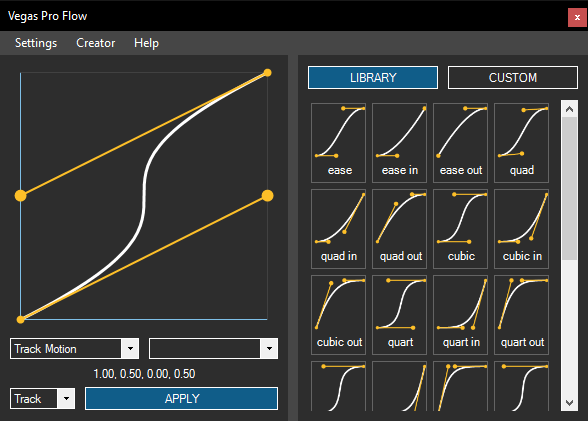

  
  
  
  
  
   
  
  

# VegasProFlow

## Overview

Apply **pre-made** curves from **LIBRARY** or **make your own** in the **CUSTOM** tab

- Double Click on a Preset to quickly Apply it

Lock the **X** or **Y** axis by holding **Shift** or **Control**

Set values manually by **clicking on the coordinates**

It will **automatically** try to select the **most relevant Effect** and **Parameter**

Change between **Event** and **Track** depending on what you want to animate

You will be notified in the **About** tab when a **new release** comes out

Check out the [YouTube playlist](https://www.youtube.com/playlist?list=PL9FpRwzrQ-HQ-SYhEQlY1euIJl_zx7ZVl) about Vegas Pro Flow

## Settings descriptions

- **Ignore long section warning** - don't show a warning for longer animated sections
- **Snap Keyframes to whole Frames** - create keyframes on the nearest frame instead of evenly spacing them
- **Auto Check for Updates**
- **Show Support view on Start**

## Special thanks

To [Angelolz](https://www.youtube.com/@angelolz1) for being an early supporter and tester of the project while providing crucial feedback.
- [Angelolz](https://www.youtube.com/@angelolz1) created: [love is an open door (とびら開けて) ╱ ver.KORO x @NightKorio](https://www.youtube.com/watch?v=Ro-KaV3iCs0)

## VEGAS setup

- Make sure you turn **ON** the **Sync Cursor** option in the **Viedo Event FX**, **Track Motion** or **Parent Track Motion** window

## How to install

Make sure you have at least [.NET 4.8 (or higher)](https://dotnet.microsoft.com/en-us/download/dotnet-framework/thank-you/net48-web-installer) installed on your computer.

### Quick install
1. Download "...13" for **13 and earlier**, or "...14" for **14 and later** Vegas Pro versions
2. Save and close VEGAS Pro
3. **Run the .exe** file, this automatically extracts the files to the selected folder
4. Click Next with the default options and wait for it to finish
5. Start VEGAS Pro and search for the Extension under **Tools - Extensions**

If it does not show up inside VEGAS Pro, try **Manual install** using multiple path choices after removing the extension from the default folder.

### Manual install
1. Delete your current version from the previous install folder
2. Download "...13" for **13 and earlier**, or "...14" for **14 and later** Vegas Pro versions
3. **Find or create** the relevant folder in **any** of the following paths:
   - %userprofile%\Documents\Vegas Application Extensions\

   If the extension does not show up in VEGAS Pro, try **any of the following paths** (change the version number to your Vegas version):

   - %localappdata%\VEGAS Pro\17.0\Application Extensions\
   - %appdata%\VEGAS Pro\17.0\Application Extensions\
   - %programdata%\Vegas Pro\17.0\Application Extensions\
   - %localappdata%\Vegas Pro\Application Extensions\
   - %appdata%\Vegas Pro\Application Extensions\
   - %programdata%\Vegas Pro\Application Extensions\
4. Extract the contents of the .zip file into the folder
5. Start VEGAS Pro and search for the **Extension** under **Tools - Extensions**
