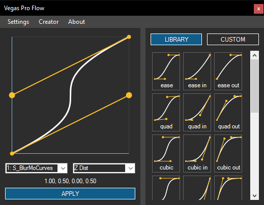

# VegasProFlow

## Overview

Apply **pre-made** curves from **LIBRARY** or **make your own** in the **CUSTOM** tab

- Double Click on a Preset to quickly Apply it

Lock the **X** or **Y** axis by holding **Shift** or **Control**

Set values manually by **clicking on the coordinates**

It will **automatically** try to select the **most relevant Effect** and **Parameter**

You will be notified in the **About** tab when a **new release** comes out

Check out the [YouTube playlist](https://www.youtube.com/playlist?list=PL9FpRwzrQ-HQ-SYhEQlY1euIJl_zx7ZVl) about Vegas Pro Flow

## Settings descriptions
- **Use Track FX** - apply to selected Track instead of selected Event
- **Ignore long section warning** - don’t show a warning for longer animated sections
- **Snap Keyframes to whole Frames** - create keyframes on the nearest frame instead of evenly spacing them
- **Auto Check for Updates**
- **Show Support view on Start**

## Videos using the help of Flow
- [Angelolz](https://www.youtube.com/@angelolz1) created: [love is an open door (とびら開けて) ╱ ver.KORO x @NightKorio](https://www.youtube.com/watch?v=Ro-KaV3iCs0)

## How to use

Make sure you have .NET 4.8 (or higher) installed.

1. Download "...13" for `13 and below`, or "...14" for `14 and above` Vegas Pro versions
2. Find or create a folder called Vegas Script Menu inside your **This PC - My Documents** folder like this:
   - `[user_name]\Documents\Vegas Application Extensions`
   - on Windows 11 try the following: `[user_name]\OneDrive\Documents\Vegas Application Extensions` 
3. Extract the contents of the .zip file into the folder above
4. Start VEGAS Pro and you can find the Script at `View - Extensions`
